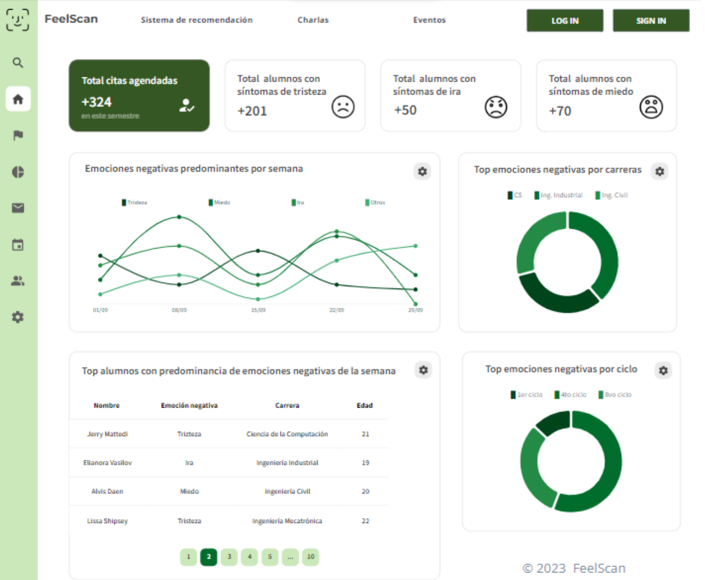
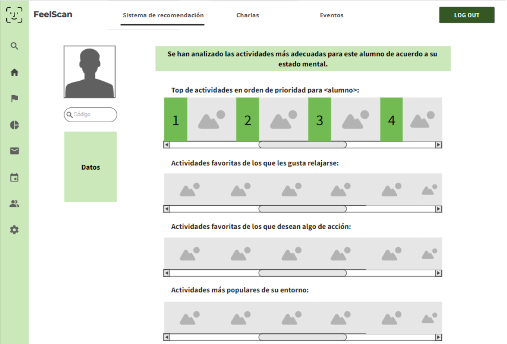
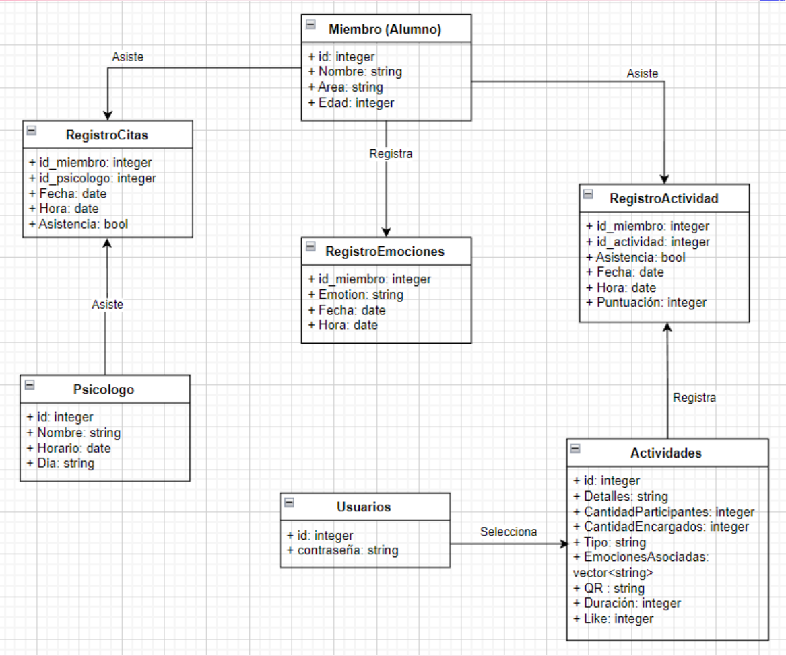

  
  
  <h1>💚 <em>FeelScan</em> 💚</h1>

<h4 align="center"><em>Sistema de recomendación (IA) de actividades
a realizar en base a las estadísticas de las emociones de los miembros en una institución, brindándole un soporte al personal o área encargada de salud mental</em></h4>
<h5 align="center"><em>Producto desarrollado en el curso de Ing. de Software - Computer Science</em></h5>
<!-- <h5 align="center">Fines académicos</h5> -->

  
<h2>&nbsp Contents</h2>

  <ul>
    <li><a href="#members">Members</a></li>
    <li><a href="#user">User</a></li>
    <li><a href="#pain-points">Pain Points</a></li>
    <li><a href="#database">Database</a></li>
    <li><a href="#components--routes">Components</a></li>
  </ul>

## Members 

|    1    |    2    |    3    |    4    |    5    |    6    |    7    |
|:------:|:------:|:------:|:------:|:------:|:------:|:------:|
**Full-Stack**|**Back-end**|**Front-end**|**Full-Stack**|**Back-end**|**Full-Stack**|**Front-end**
|Marcela  Espinoza  Herrera|José  Osnayo   Matos|Margiory Alvarado Chávez|Milloshy  Crisóstomo Rodríguez|Kelvin Cahuana Condori|Adrian Sandoval Huamaní|Fabiola Guardamino Morales
<!--  |  |  |  |  |  |  -->

## User

Área encargada de salud y bienestar que proporcionan actividades y seguimientos psicilógicos a los miembros de una institución.

<!-- 
### Utils

- Prioridades en agendar citas con psicólogos.
- Programas de ayuda.
- Emociones en proporción a la carrera, edad, ciclo, o algún periodo en tendencia (Ej. la semana de exámenes).
- Reportes por periodo de tiempo
- Evaluar mejora en los estudiantes citados. -->

## Pain Points

|||
|--|--|
1.|No saber qué alumnos priorizar para su atención psicológica. A mayor cantidad de estudiantes, mayor es la dificultad de atención para todos. Puesto que las reservas para estas citas se agotan en las primeras semanas de clases.
2.|En caso exista un bajo rendimiento académico de un estudiante está asociado con un problema emocional (salud mental, motivación, etc.) o tenga otro tipo de dificultades que no es muy aentrado a la sociabilidad o autoconfianza con déficits de salud.
3.|Los estudiantes pocos sociables para integrarlos a las actividades de la universidad con distintos tipos de talleres que sean efectivos para el desarrollo de esa emoción
4.|Los estudiantes que no responden las encuestas que realiza bienestar estudiantil para saber la condición de los estudiantes en determinado tiempopor cuestión de tiempo o vergüenza.

<!-- ## Requirements

- Acceso y registro a través de una credencial y una contraseña.
- Indicar cuál la emoción actual más predominante en todos los miembros de la institución.
- Indicar cuál es el porcentaje de cada área de la institución que presenta esa emoción predominante.
- Informar una lista, en orden de prioridad, de los miembros con la emoción negativa muy recurrente en el lapso de una semana.
- Informar una lista, en orden de prioridad, de acuerdo a la mejora o desmejora de cada estudiante evaluado para brindar la ayuda psicológica respectiva por la institución.
- Facilitar la comunicación entre el miembro y un especialista para agendar una cita psicológica.
- Analizar emociones para cada área de la institución con la cantidad de miembros que presentan cada emoción, de manera continua o porcentual y por un intervalo temporal (día, semana, mes y año) seleccionable.
- Recomendar una lista de actividades, con orden de predominancia, que la institución puede realizar para cada emoción a partir de un catálogo.
- Ofrecer la sección de actividades donde se encuentra todo el sistema de recomendación.
- Recomendar alguna actividad en base a lo que se muestra en la lista de actividades que más les gusta a la mayoría de las personas con X emoción.
- Recomendar en base a las elecciones del equipo psicopedagógico de la institución.
- Mostrar detalles en el sistema de recomendación de la actividad a realizar especificando aforo de aprobación, mínimo de participantes, duración, emociones asociadas, y tipo. -->

## Database

[ tipo de base de datos ]
[ las base de datos que se utilizan ]

## Development

[ explicación de la arquitectura y funcionamiento de la plataforma ]

## Components

[ componentes que está distribuido la plataforma web ]

## Dataset

[ generacion de datos para realizar las estimaciones ]

## Deployment

[ despliegue de la plataforma web para pruebas de fetching e interacción con el usuario ]

## Annexes

### Primer prototipo en [Mockups](https://app.moqups.com/L4DOzpgZmVrPYT0dtXQNG5a2IRYaGvHz/edit/page/ade76401d)

| |  |  |
|-|-|-|

### Diagrama de clases

  

